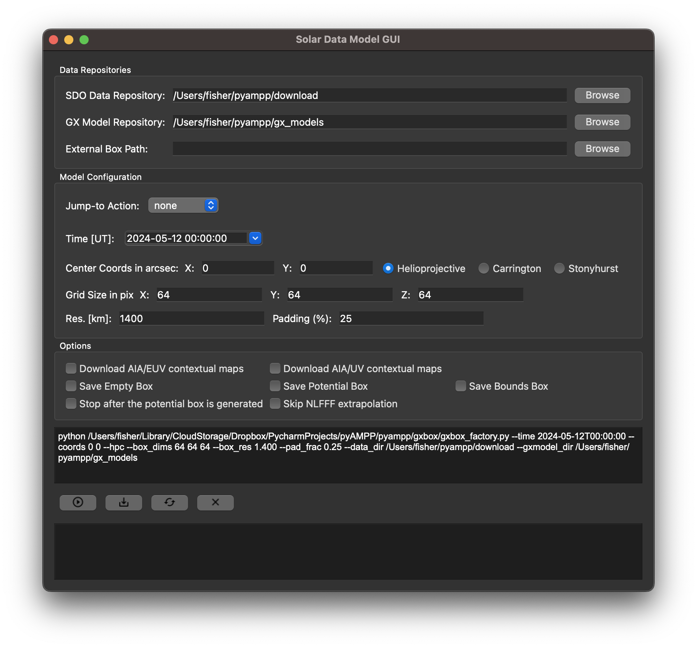
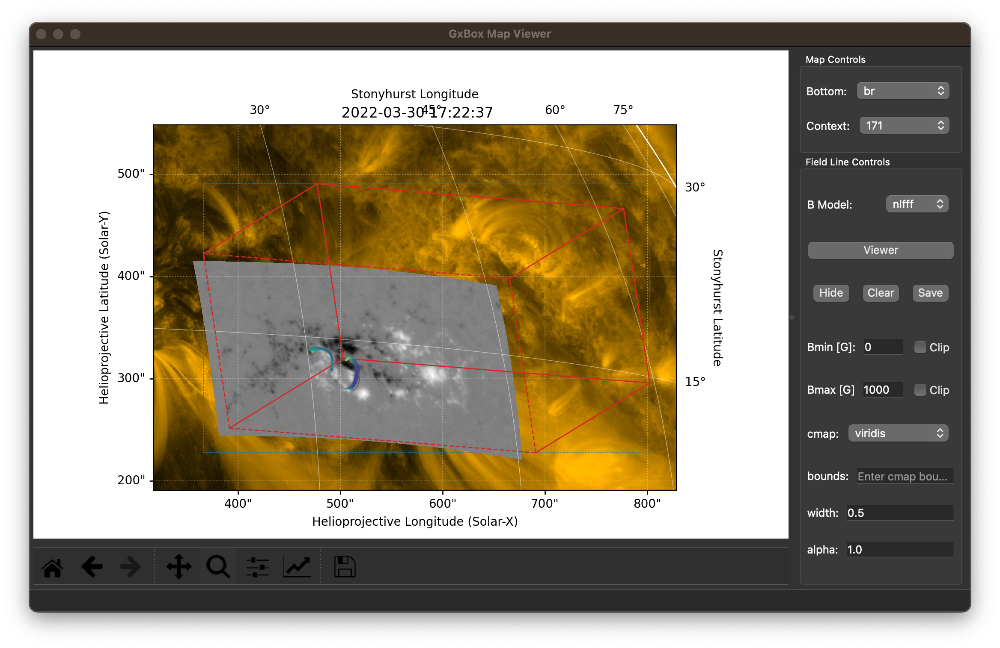
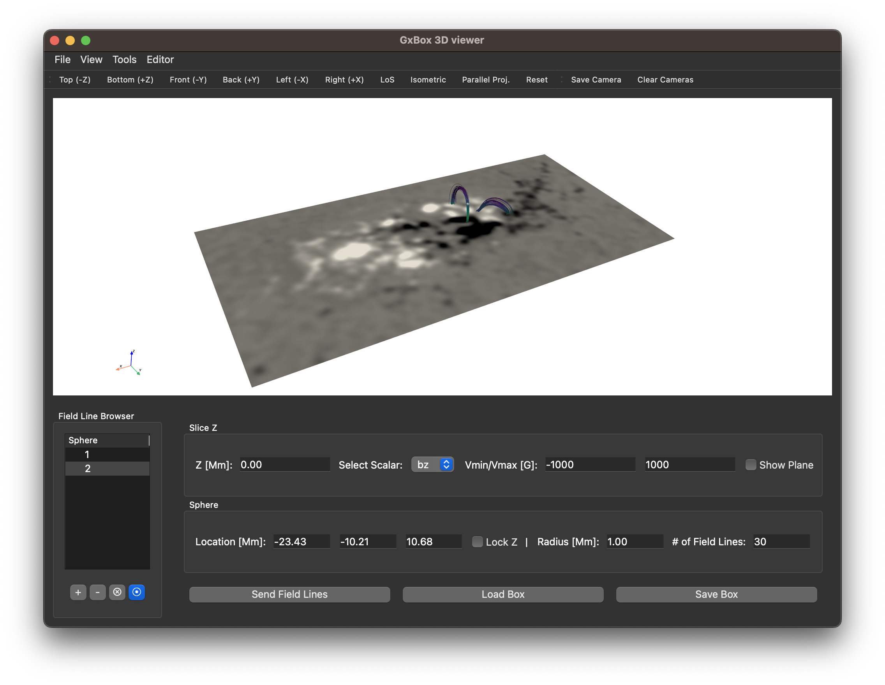

pyAMPP: Python Automatic Model Production Pipeline
==================================================

**pyAMPP** is a Python implementation of the Automatic Model Production Pipeline (AMPP) for solar coronal modeling.  
It streamlines the process of generating realistic 3D solar atmosphere models with minimal user input.

Overview
--------

**AMPP** automates the production of 3D solar models by:

- Downloading vector magnetic field data from the Helioseismic and Magnetic Imager (HMI) onboard the Solar Dynamics Observatory (SDO)
- Optionally downloading contextual Atmospheric Imaging Assembly (AIA) data
- Performing magnetic field extrapolations (Potential and/or Nonlinear Force-Free Field)
- Generating synthetic plasma emission models assuming either steady-state or impulsive heating
- Producing non-LTE chromospheric models constrained by photospheric measurements
- Enabling interactive 3D inspection and customization through user-friendly GUIs

Installation
------------

Install the latest version from PyPI:

.. code-block:: bash

    pip install -U pyampp

Main Interfaces
---------------

pyAMPP installs two GUI applications:

1. **gxampp** – Launches a GUI to select observation time and coordinates. It then invokes `gxbox` to build the 3D model.
2. **gxbox** – Launches a GUI that builds and displays the 3D magnetic field and plasma model. Can be run independently if coordinates are known.

Usage Examples
--------------

**1. Launch the time/coord selector (gxampp)**

.. code-block:: bash

    gxampp

**2. Launch the modeling GUI directly (gxbox)**

.. code-block:: bash

    gxbox \
      --time "2022-03-30T17:22:37" \
      --coords 34.44988566346035 14.26110705696788 \
      --hgs \
      --box-dims 360 180 200 \
      --box-res 0.729 \
      --pad-frac 0.25 \
      --data-dir /path/to/download_dir \
      --gxmodel-dir /path/to/gx_models_dir \
      --external-box /path/to/boxfile.gxbox

The `gxbox` GUI automatically downloads the required solar data and builds the 3D model based on the user's input. The resulting model can be visualized in a VTK-based viewer that supports interactive exploration of the magnetic field structure.

Additionally, users can trace and extract magnetic field lines within the 3D model and send them back to the `gxbox` GUI, where they can be overlaid on solar images for contextual visualization.

Notes:

- `--coords` takes two floats, separated by space (no brackets or commas).
- One of `--hpc`, `--hgc`, or `--hgs` must be specified to define the coordinate system.
- Remaining parameters are optional and have default values.

Entrypoints
-----------

After installation, the following commands become available:

- ``gxampp``: Launch the time and location GUI.
- ``gxbox``: Launch the modeling GUI directly with CLI options.

License
-------

Copyright (c) 2024, `SUNCAST <https://github.com/suncast-org/>`_ team. Released under the 3-clause BSD license.